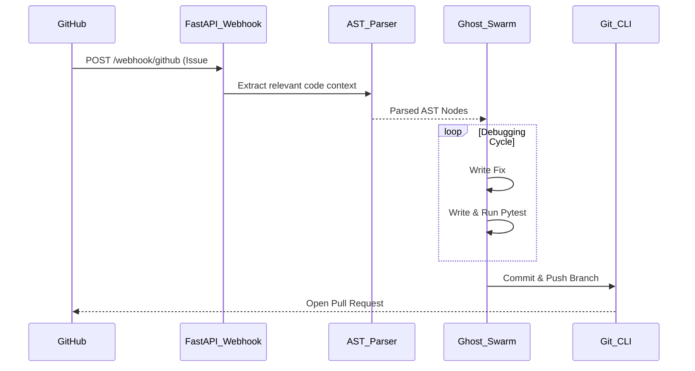

<div align="center">
  <h1>👻 Ghost Developer</h1>
  <p><b>An autonomous AI developer that lives in your repository, fixes bugs, and submits PRs while you sleep.</b></p>

  <a href="https://github.com/lakshanmuruganandam/ghost-developer/blob/main/LICENSE">
    
  </a>
  
  
  
</div>

<br/>

## 📖 The Story
I was losing 15+ hours a week reviewing minor Pull Requests and fixing syntax bugs instead of actually building my startup. I was burning out.

I built **Ghost Developer**—an autonomous AI agent swarm that listens to your GitHub webhooks. When an issue is tagged `bug`, it wakes up, clones the repo, fixes the bug, runs tests locally, and submits a PR. 

No SaaS subscriptions. No granting read/write access to third-party corporate APIs. Absolute privacy on your local machine.

## ✨ Core Features
- **Zero-Cloud Inference:** Runs completely locally, ensuring proprietary codebase privacy.
- **Context-Aware Slicing:** Bypasses massive context limits by surgically extracting relevant Python classes via AST parsing.
- **Self-Healing Test Loops:** Isolated testing agents write `pytest` scripts and debug their own code until it passes.
- **Git Automation:** Fully automates branch creation, commits, and Pull Request submission.

## 🛠️ Installation & Setup

### Prerequisites
- Python 3.10+
- Git CLI installed and authenticated
- Local LLM Runner (e.g., Ollama) or valid API Keys in `.env`

### Quick Start
```bash
# 1. Clone the repository
git clone https://github.com/lakshanmuruganandam/ghost-developer.git
cd ghost-developer

# 2. Set up virtual environment
python3 -m venv .venv
source .venv/bin/activate

# 3. Install dependencies
pip install -r requirements.txt

# 4. Run the Ghost Developer Orchestrator
uvicorn src.main:app --reload --port 8000
```

### Webhook Configuration
Expose your local `8000` port using `ngrok` or `cloudflare tunnels` and point your GitHub Repository Webhooks to:
`http://<your-ngrok-url>/webhook/github`
Select content type `application/json` and trigger on **Issues**.

## 🧠 Architecture (How it works)



## 🐛 Recent Bug Fixes & Changelog
- **v1.0.1:** Fixed `422 Unprocessable Entity` webhook validation failures by patching Pydantic v2 `Optional` typing schemas.
- **v1.0.0:** Migrated `BaseSettings` configuration to modern Pydantic v2 `SettingsConfigDict` to resolve deprecation warnings.
- **v0.9.0:** Initial Swarm logic implemented with asynchronous Agent execution.

## 🤝 Contributing
I would absolutely love your feedback or suggestions on how to improve the AST parsing or agent routing! 
1. Fork the Project
2. Create your Feature Branch (`git checkout -b feature/AmazingFeature`)
3. Commit your Changes (`git commit -m 'Add some AmazingFeature'`)
4. Push to the Branch (`git push origin feature/AmazingFeature`)
5. Open a Pull Request

## 📜 License
Distributed under the MIT License. See `LICENSE` for more information.

---
*Built by [Lakshan Muruganandam](https://github.com/lakshanmuruganandam) to completely eradicate the technical bottlenecks of early-stage startups.*
