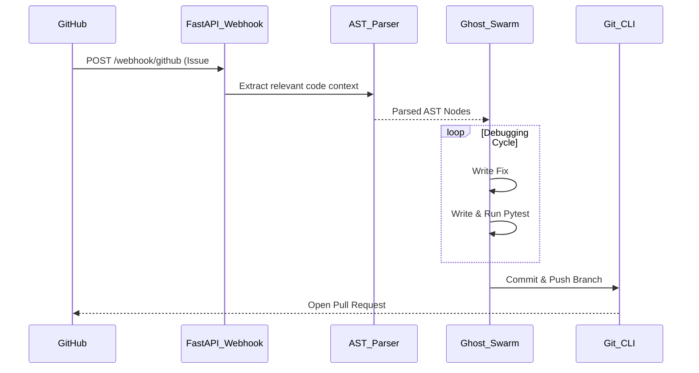

<div align="center">
  <h1>👻 Ghost Developer</h1>
  <p><b>An autonomous AI developer that lives in your repository, fixes bugs, and submits PRs while you sleep.</b></p>

  
  
  
</div>

## The Problem
You are losing 15+ hours a week reviewing minor Pull Requests and fixing syntax bugs instead of actually building your startup. You are burning out.

## The Solution
I built **Ghost Developer**—an autonomous AI agent swarm that listens to your GitHub webhooks. When an issue is tagged "bug", it wakes up, clones the repo, fixes the bug, runs tests locally, and submits a PR. 

No SaaS subscriptions. No granting read/write access to third-party corporate APIs. 

## How it Works (Under the Hood)
1. **GitHub Webhooks & FastAPI:** A localized server listens for new GitHub issues.
2. **AST Parsing:** To bypass LLM context limits, the system doesn't feed your 50,000-line codebase to the LLM. Instead, it uses an Abstract Syntax Tree (AST) parser to surgically extract only the relevant classes and functions.
3. **Multi-Agent Swarm (`asyncio`):** 
   - A *Primary Agent* writes the bug fix.
   - A *Testing Agent* writes `pytest` scripts and executes them locally.
   - If tests fail, the swarm loops and self-debugs.
4. **Git Automation:** Uses subprocesses to automatically checkout a branch, commit the fix, and push the Pull Request.

## Architecture



## Setup & Run
```bash
pip install -r requirements.txt
uvicorn src.main:app --reload --port 8000
```
Then, point your GitHub repository Webhook to your local server (e.g., using `ngrok`).

---
*Built to completely eradicate the technical bottlenecks of early-stage startups.*
